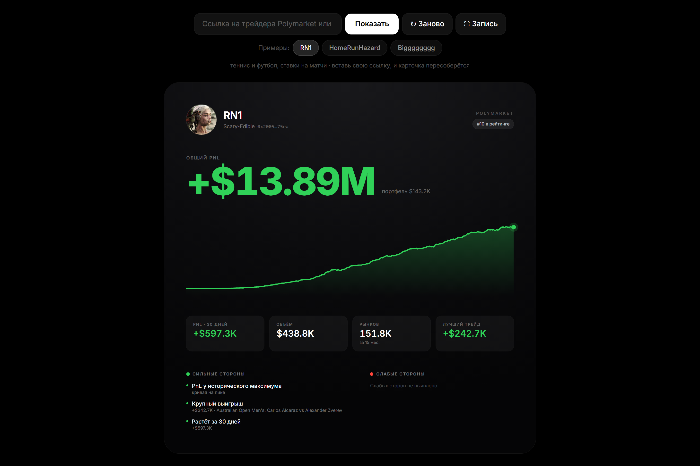
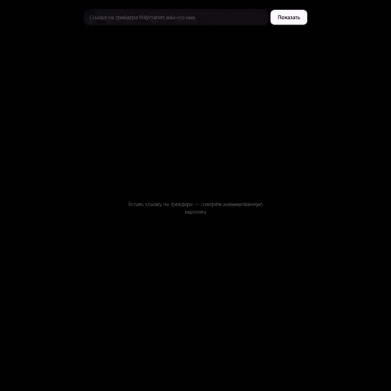
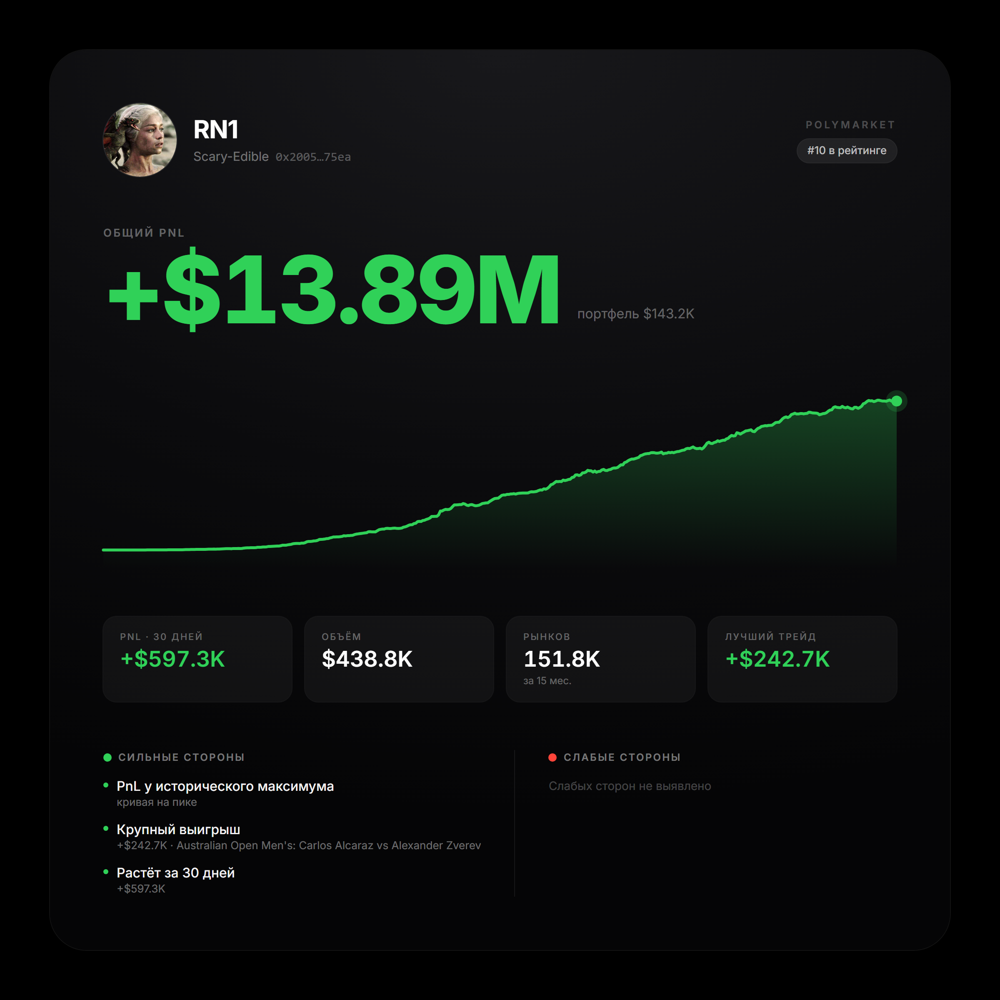

# Polymarket Trader Card

Дашборд: вставляешь ссылку на трейдера Polymarket (или его имя) и получаешь
анимированную карточку 1:1 в стиле Apple для записи видео.

**Живое демо:** https://sixsechszes-666.github.io/poly-dashboard/

## Демо

Экран приложения: вводишь имя трейдера, карточка собирается и проигрывает
анимацию сама.



Анимация карточки целиком, 14 секунд:



Кадр для записи, 1080x1080 на чёрном фоне, без интерфейса вокруг:



Полное видео в 1080x1080 - [`docs/poly-dashboard.mp4`](docs/poly-dashboard.mp4).

## Что внутри

- Страница открывается на живом трейдере из лидерборда Polymarket: карточка
  собирается сама, без единого ввода. Рядом чипы «Примеры» с ещё двумя,
  можно щёлкать и смотреть анимацию заново.
- Общий PnL, стоимость портфеля, график PnL за всё время.
- Плитки: PnL за 30 дней, объём торгов, число рынков, лучший трейд.
- Авто-инсайты «сильные / слабые стороны», считаются из самих данных,
  без ручных порогов под конкретного трейдера.
- Режим **Запись**: чистый чёрный экран с одной карточкой 1080x1080,
  готовый кадр под вертикальное видео.

## Запуск

```bash
npm install        # если падает с ECONNRESET - см. примечание ниже
npm run dev
```

Открой адрес из консоли (обычно `http://localhost:5173`).

> Примечание: если `npm install` обрывается с `ECONNRESET`, выполни
> `npm config set maxsockets 1` и запусти `npm install` повторно 2-3 раза,
> докачает остаток.

## Как пользоваться

1. Открой страницу. Карточка примера грузится и проигрывает анимацию сразу,
   без ввода.
2. Щёлкни по другому чипу в ряду «Примеры», чтобы открыть вторую карточку.
3. Своя карточка: вставь в поле ссылку на профиль
   (`polymarket.com/profile/0x...`), адрес `0x...` или имя трейдера
   и нажми **Показать**.
4. Если по имени нашлось несколько трейдеров, появится список, выбери нужного.
5. **↻ Заново** повторяет анимацию.
6. **⛶ Запись** убирает всё, кроме карточки. `Esc` выход, `Пробел` повтор.

## Данные

Три публичных API Polymarket: `data-api`, `gamma-api`, `user-pnl-api`.
Все три отдают `access-control-allow-origin: *`, поэтому браузер ходит в них
напрямую, без dev-прокси и без бэкенда. Приложение одинаково работает
и локально, и со статичного хостинга.

Винрейт не отображается намеренно: открытый API отдаёт только выигрышные
выкупленные позиции, поэтому честный процент побед по нему посчитать нельзя.
Показывать красивую цифру, которая врёт, смысла нет.

## Стек

Vite 7, React 19, TypeScript, Tailwind CSS 4, Motion, TanStack Query.

## Структура

```
src/
├── App.tsx              экран, ввод ссылки, подборка примеров, режим записи
├── api/polymarket.ts    клиент трёх публичных API
├── hooks/useTrader.ts   загрузка и сборка данных трейдера
├── lib/
│   ├── featured.ts      трейдеры-примеры, на которых открывается страница
│   ├── resolve.ts       ссылка или имя -> адрес кошелька
│   ├── metrics.ts       PnL, объём, лучший трейд, просадки
│   ├── insights.ts      правило-движок инсайтов
│   ├── categories.ts    разбор категорий рынков
│   └── format.ts        форматирование денег и чисел
└── components/          карточка, график, плитки, аватар
```

## Деплой

Пуш в `main` запускает `.github/workflows/deploy.yml`: сборка и выкладка
`dist` на GitHub Pages. `base` в `vite.config.ts` выставлен под project-сайт.
